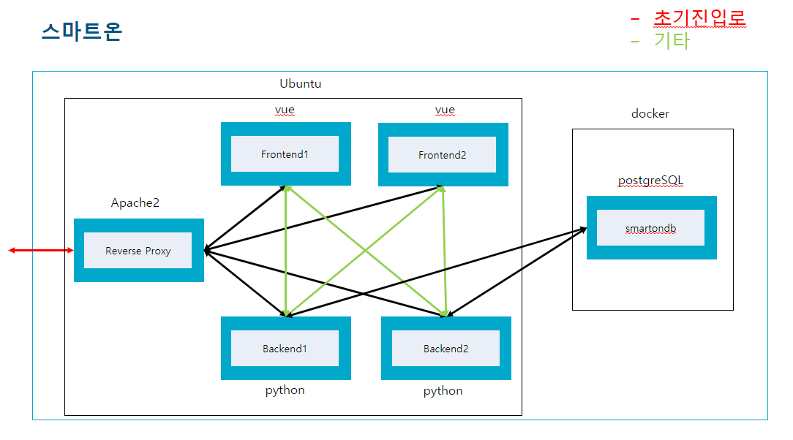

# <a href="https://smart-on.co.kr" target="_blank">Smart-ON</a>

## 프로젝트 시작하게 된 동기

### 이번 프로젝트는 B to C 기반으로 기획했다. 공공데이터 기반으로 서비스를 제공해야 겠다고 생각했으며, 주 타켓팅은 공무원을 타켓팅하여 해당 기관이 목표로한 방향성과 부합하게 도시를 잘 운영하고 있는지 분석해주는 서비스를 만들었다. 그렇다고 너무 공무원 집중적이지는 않다. 부가 서비스(?) 개념으로 코로나 서비서와, 4.15총선 페이지를 추가함으로써 일반 시민도 접근할 수 있는 경로를 제공하였다. 앞으로 더 개선해 나가야할 점이 많다.

<br/><br/>

## 시스템 구성환경

### 시스템 구성환경은 아래와 같다. 기존 공공기관을 타켓팅하는 서비스보다는 언어의 제한이 줄어들었다. 기본적으로 기존에는 IE9까지 지원해야 했지만, 현재 이 서비스는 IE11까지 지원하는 것을 목표로 삼았다. 그래서 우리는 현재 인기가 급부상하고 있고, 러닝커브가 낮은 VueJS 프레임워크를 채택하기로 하였다. 또한, ES6이상 Javscript / HTML5 / CSS3를 사용하여 개발을 진행하였다. NuxtJS는 시간이 부족한 관계로 진행하지 못하였지만, 추후에 적용시킬 예정이다.

<br/><br/>

|    유형    |                       스택                       | 참여(율) |
| :--------: | :----------------------------------------------: | :------: |
| `Frontend` | VueJS, HTML5, javascript(es6), css3(Media-Query) |  O(80%)  |
| `Backend`  |                      dJango                      |    X     |
| `Database` |                    postgreSQL                    |    X     |
|  `Infra`   |    Iaas(iwinV, Docker, Reverse proxy server)     | O(100%)  |
| `Library`  |          jQuery, vuetify, leafletJS, d3          |          |

<br/><br/>

## 프로세스 흐름도

### 무중단 수동배포도 포함되어 있으므로 매우 복잡하다...

<br/>



<br/><br/>

## 기능

1. 빅데이터 & 인공지능으로 진단하고 처방하는 도시분석 서비스

2. 공공데이터기반

3. 부가서비스 지원(코로나현황 + 4.15 3.

4. 모바일 지원

<br/><br/>

## 실제 화면

<br/>


<br/><br/>

## 이슈사항

- 데이터업데이트 자동화 프로세스 생성
- 여러 해상도 지원

<br/><br/>

## 개선사항

- NuxtJS 도입

<br/><br/>

## 환경세팅

```bash
git clone https://github.com/Hulkong/Smart-On.git
cd ./Smart-On

# install dependencies
npm install
```

### 개발

```bash
# serve with hot reload at localhost:8080
npm run dev
```

### 배포

```bash
# build for production with minification
npm run build

npm install -g serve

serve -s dist
```
