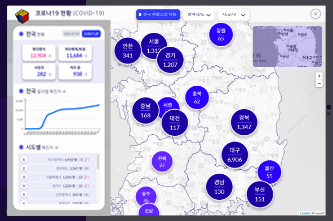
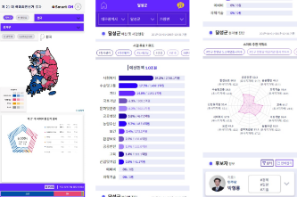

# <a href="https://smart-on.co.kr" target="_blank">Smart-ON</a>

## - 빅데이터 & 인공지능으로 진단하고 처방하는 도시분석 서비스

## - 공공데이터기반

## - 부가서비스 지원(코로나현황 + 4.15 대선)

## - 모바일 지원

<br/><br/>

|    유형    |                       스택                       | 참여(율) |
| :--------: | :----------------------------------------------: | :------: |
| `Frontend` | VueJS, HTML5, javascript(es6), css3(Media-Query) |  O(80%)  |
| `Backend`  |                      dJango                      |    X     |
| `Database` |                    postgreSQL                    |    X     |
|  `Infra`   |    Iaas(iwinV, Docker, Reverse proxy server)     | O(100%)  |
| `Library`  |          jQuery, vuetify, leafletJS, d3          |          |

<br/><br/>





## Build Setup

```bash
# install dependencies
npm install

# serve with hot reload at localhost:8080
npm run dev

# build for production with minification
npm run build
```
